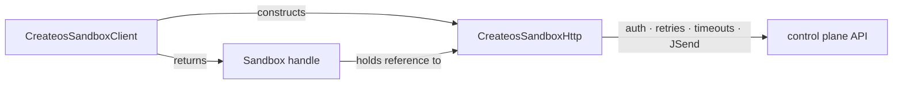

# The handle model

The SDK exposes two stateful objects: **`CreateosSandboxClient`** and **`Sandbox`**. Understanding the relationship between them — and the transport layer that connects them — explains most of how the SDK behaves.

## Two objects, one responsibility each

`CreateosSandboxClient` is the entry point and factory. It owns the resolved configuration (base URL, API key, default timeouts, retry policy) and surfaces catalog and cross-sandbox operations: listing sandboxes, templates, shapes, disks, and networks. Its job is to produce `Sandbox` handles.

`Sandbox` is the handle. It owns exactly one sandbox id. Every per-sandbox operation — lifecycle (`pause`, `resume`, `destroy`), command execution (`runCommand`, `streamCommand`), file transfer (`files.upload`, `files.download`), network and disk operations, and the `waitUntil*` pollers — lives on this object. Once you have a handle you rarely need the client again.

## Data flow



`CreateosSandboxHttp` is the transport layer. It handles URL construction, API key injection, JSend envelope unwrapping, exponential backoff with jitter, `Retry-After` honor, per-request timeouts, and `AbortSignal` composition. Neither the client nor the handle touches raw `fetch` directly — all wire calls go through the transport.

The critical structural detail: a `Sandbox` holds a reference to the **transport** (`#http: CreateosSandboxHttp`), not to the client. The client's only role is to configure the transport and pass it into the handle constructor:

```ts
// getSandbox — how the client wires things together
async getSandbox(id: string, options: RequestOptions = {}): Promise<Sandbox> {
  const view = await this.http.request<SandboxView>("GET", `/v1/sandboxes/${encodePath(id)}`, options);
  return new Sandbox(this.http, view);
}
```

Once `new Sandbox(this.http, view)` runs, the handle is self-sufficient. It carries the same transport object the client used, so it can make authenticated, retried, timed-out requests on its own.

This matters for three reasons:

1. **Handles outlive the client.** Let the client go out of scope, hand the handle to another function or store it in a map — it keeps working. There is no hidden back-reference to the client that could become a dangling pointer or introduce unexpected shared mutable state.
2. **Handles are cheap to pass around.** A `Sandbox` is a thin wrapper over a transport reference and a cached view; copying or sharing it has no overhead beyond reference counting.
3. **No circular dependencies.** `Sandbox` imports `CreateosSandboxHttp` but never imports `CreateosSandboxClient`. The dependency graph is a DAG.

## Getting a handle

Two paths, same result type:

**`client.createSandbox(request, options)`** — provisions a new sandbox and returns a live handle. Under the hood it `POST /v1/sandboxes`, then does a follow-up `GET` to fetch the full `SandboxView` (the create response omits fields like `status` and `created_at` that the handle needs). The follow-up GET inherits the caller's timeout and retry options, not just the abort signal.

**`client.getSandbox(id, options)`** — reconnects to an existing sandbox by id. Issues a single `GET /v1/sandboxes/:id` and wraps the result in a handle. Use this when you stored an id from a previous session and want to resume work against it.

Both return `Promise<Sandbox>`. The handle type is identical regardless of how it was obtained.

There are also static convenience factories on `Sandbox` itself — `Sandbox.create(...)` and `Sandbox.connect(...)` — for situations where constructing a client first would be ceremony. They delegate to `new CreateosSandboxClient(clientOpts).createSandbox(...)` and `.getSandbox(...)` respectively.

## Local view vs. server truth

Every `Sandbox` caches a snapshot of server state called the **view** (`#data: SandboxView`). The view holds the fields the server returned at the time the handle was created or last refreshed: `id`, `status`, `ip`, `vcpu`, `mem_mib`, `disk_mib`, `created_at`, `ingress_enabled`, and more.

Reading `sandbox.status`, `sandbox.ip`, or `sandbox.data` reads the **last-known view** — not a live server call. If the server state has changed (a sandbox finished booting, was paused by someone else, ran out of bandwidth quota), the handle does not know until it re-fetches.

Three things update the cached view:

- **`sandbox.refresh()`** — issues a `GET /v1/sandboxes/:id` and replaces `#data` in place. Returns `this` so you can chain.
- **Mutating calls** — `pause()`, `resume()`, `fork()`, `destroy()`, `resize()`, and similar methods all replace `#data` with the response the server returned. The view is always current after a successful mutating call.
- **`waitUntil*` pollers** — each poll iteration calls `refresh()` internally (via `pollUntil`), so by the time `waitUntilRunning()` resolves, the handle reflects the state the server confirmed.

`toJSON()` returns the same `#data` object that `sandbox.data` exposes, so `JSON.stringify(sandbox)` serializes the last-known view. Treat the returned object as read-only; mutating it corrupts the getters' backing store.

```ts
const sandbox = await client.createSandbox({ shape: "s-4vcpu-4gb", rootfs: "devbox:1" });

// Status here is whatever the create response reported — likely "creating".
console.log(sandbox.status);

// Wait until the control plane reports "running", polling with adaptive backoff.
await sandbox.waitUntilRunning();

// Now the cached view is up to date.
console.log(sandbox.status); // "running"
console.log(sandbox.ip);     // "10.x.x.x"
```

## Why a handle, not a flat client

The alternative — common in REST-shaped SDKs — is to put every operation on a single client, requiring callers to pass sandbox ids explicitly to every call:

```ts
// what a flat API looks like
await client.pause(sandboxId, options);
await client.waitUntilPaused(sandboxId);
await client.destroy(sandboxId, options);
```

That pattern has two costs. First, id strings leak into every call site; callers must track them manually. Second, any operation that requires polling (waiting for a state transition) needs a custom loop — fetch, check status, sleep, repeat — with all the timeout and error-handling logic that entails.

The handle model collapses both problems. The id is bound once at handle construction and never mentioned again. The `waitUntil*` helpers (`waitUntilRunning`, `waitUntilPaused`, `waitUntilDestroyed`) embed the polling loop with adaptive backoff (250ms start, ramps after 5s, 2s cap) and a configurable timeout budget. Lifecycle sequences read naturally:

```ts
try {
  const sandbox = await client.createSandbox({ shape: "s-4vcpu-4gb", rootfs: "devbox:1" });
  await sandbox.waitUntilRunning();
  const result = await sandbox.runCommand("python3", ["train.py"]);
  console.log(result.stdout);
} finally {
  await sandbox.destroy();
}
```

No id strings. No poll loop. No duplicated timeout logic. The handle carries its own state and knows how to wait for the server to catch up.

---

See also:

- [`CreateosSandboxClient` reference](../reference/client.md) — all factory methods and catalog operations
- [`Sandbox` reference](../reference/sandbox.md) — full handle API surface
- [Sandbox lifecycle](./lifecycle.md) — status transitions and what the `waitUntil*` helpers guard against
- [Reliability and retries](./reliability.md) — how the transport's retry policy interacts with the pollers
