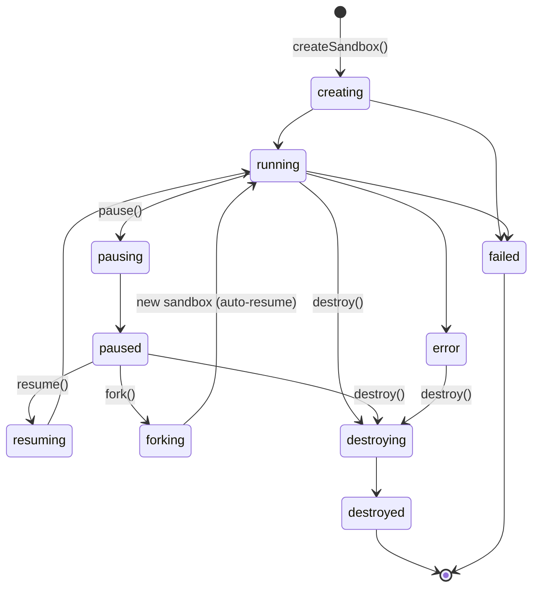

# Sandbox lifecycle

A sandbox moves through a small, well-defined state machine. The SDK's
lifecycle methods — `pause`, `resume`, `fork`, `destroy`, `setAutoPause` —
request transitions on the control plane. The `waitUntil*` helpers then observe
the transition by polling until the target state is reached. Understanding the
model makes it easier to reason about billing, error handling, and when a
`waitUntil*` call is necessary.

For the recipes (code snippets, option tables) see
[../how-to/lifecycle.md](../how-to/lifecycle.md). For the handle and caching
model see [./handle-model.md](./handle-model.md). Full method signatures are in
[../reference/sandbox.md](../reference/sandbox.md).

---

## States

`SandboxStatus` in `src/types.ts` is the authoritative union:

| State | Meaning |
| --- | --- |
| `creating` | Control plane is provisioning the VM; not yet reachable. |
| `running` | VM is live and accepting connections. Compute is billed. |
| `pausing` | Pause requested; memory and disk snapshot in progress. |
| `paused` | VM is suspended; snapshot persisted. Compute billing stopped. |
| `resuming` | Resume requested; restoring from snapshot. |
| `forking` | Snapshot is being cloned into a new independent sandbox. |
| `destroying` | Destroy requested; reclaim in progress (async). |
| `destroyed` | VM reclaimed; row is terminal. No further transitions possible. |
| `error` | VM encountered a non-fatal error. May still be recoverable. |
| `failed` | Terminal failure; the sandbox cannot recover. |

Transitional states (`creating`, `pausing`, `resuming`, `forking`,
`destroying`) settle into a steady or terminal state. The `waitUntil*` helpers
exist precisely because the method call that requests a transition returns as
soon as the server acknowledges it — the sandbox may still be in the
transitional state at that point.



`fork()` leaves the parent in `paused`; the diagram shows the *child* sandbox
reaching `running` (unless `start_paused: true` is passed, in which case the
child lands in `paused`).

---

## Pause and resume

Calling `pause()` snapshots the VM's entire memory and disk state to durable
storage, then suspends the VM. From the billing perspective, compute charges
stop the moment the sandbox reaches `paused`.

Calling `resume()` restores the snapshot in place — same sandbox id, same
memory contents, same filesystem. Processes pick up exactly where they left off.
This is categorically different from destroying a sandbox and creating a fresh
one: a fresh boot starts from the rootfs image with no memory state.

Key properties:

- **Memory is preserved.** In-flight work, loaded models, warm caches — all
  restored on resume.
- **Disk is preserved.** The same block device is remounted; filesystem state
  is consistent.
- **Compute billing stops while paused.** Only storage costs (if any) apply.
- **Same sandbox id throughout.** Handles, URLs, and any persistent
  configuration remain valid.

The `pause()` call itself returns a view that may show `pausing` — the
transition is not instantaneous. Always pair with `waitUntilPaused()` before
relying on the paused state (e.g. before calling `fork()`).

---

## Fork

`fork()` clones the snapshot of a `paused` sandbox into a new, fully
independent sandbox. The two diverge from that point — changes in one do not
affect the other. The parent remains `paused`; it can be forked again or resumed
independently.

The child sandbox starts auto-resuming after the fork API call returns. Pass
`start_paused: true` in the `ForkSandboxRequest` if you want the child to stay
paused until you explicitly call `resume()` on it.

Because `fork()` operates on a snapshot, the source must be `paused` (or
`pausing`). Calling `fork()` on a `running` sandbox throws
`CreateosSandboxValidationError`. The safe pattern:

```ts
await sandbox.pause();
await sandbox.waitUntilPaused();
const clone = await sandbox.fork();
await clone.waitUntilRunning();
```

`fork()` is the recommended way to branch from a known checkpoint — for
example, to run parallel experiments from the same environment without
rebuilding it.

---

## Auto-pause and billing

An idle sandbox continues to consume compute resources until it is paused or
destroyed. The `auto_pause_after_seconds` setting delegates the pause decision
to the control plane: when the sandbox sits idle for the configured number of
seconds, the control plane pauses it automatically — identically to calling
`pause()` manually. Compute billing stops; memory and disk state are preserved.

The valid range is 60–86400 seconds (1 minute to 24 hours). Set it at create
time or update it on a live sandbox:

```ts
await sandbox.setAutoPause(300);  // pause after 5 min idle
await sandbox.setAutoPause(null); // disable
```

`setAutoPause` is the primary cost-control lever for long-running or
intermittently used sandboxes. The sandbox.status after an auto-pause is
`paused`, exactly as after a manual `pause()` — resume and fork work
identically.

---

## Observing state

The `waitUntil*` helpers poll the server with adaptive backoff until the target
status is reached:

- `waitUntilRunning()` — resolves when status is `running`; aborts on `error`,
  `failed`, `destroying`, `destroyed`.
- `waitUntilPaused()` — resolves when status is `paused`; aborts on `error`,
  `failed`, `destroying`, `destroyed`.
- `waitUntilDestroyed()` — resolves when status is `destroyed`; aborts on
  `error` or `failed` (not on `destroying` — that is an intermediate step).

The polling interval starts at 250 ms, ramps after 5 s, and caps at 2 s. This
keeps fast transitions snappy without hammering the API on slower ones. All
three helpers accept a `timeoutMs` option; exceeding it throws
`CreateosSandboxTimeoutError`.

`sandbox.status` is the *last-known cached* value — it reflects the status from
the most recent API response received by this handle. It does not poll the
server on access. See [./handle-model.md](./handle-model.md) for details on the
caching model and when the cached view is stale.

`destroy()` is asynchronous server-side: it returns when the control plane has
accepted the request, but the sandbox may still be in `destroying` at that
point. Call `waitUntilDestroyed()` to confirm that the VM has been fully
reclaimed before treating the id as gone.

---

## Pause vs. fork vs. destroy

| Operation | Effect | Sandbox id | Memory | Disk | Billing |
| --- | --- | --- | --- | --- | --- |
| `pause()` | Suspend same sandbox | unchanged | preserved | preserved | stops |
| `resume()` | Restore same sandbox | unchanged | restored | restored | resumes |
| `fork()` | Branch into new sandbox | new child id | copied at fork point | copied at fork point | child billed separately |
| `destroy()` | Permanent reclaim | terminal | lost | lost | stops |

Use `pause` when you want to save cost and resume later. Use `fork` when you
want a branch from a checkpoint — parallel experiments, rollback points, or
cloned environments. Use `destroy` when the sandbox is no longer needed at all.
A destroyed sandbox cannot be recovered; there is no undo.
