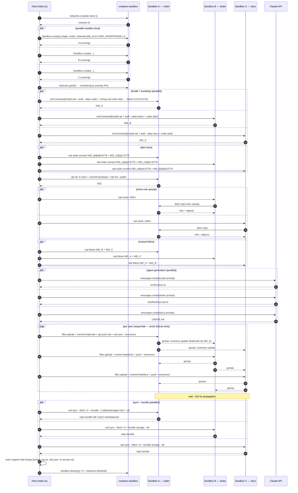

# 12 — Radicle p2p git mesh with role-specialised Claude agents

Three createos-sandbox sandboxes joined to an overlay network each run a [Radicle][rad]
node (Heartwood 1.9). Three Claude agents — coder, tester, docs — write
their contributions, the sandboxes commit on role-specific branches and
push to Radicle, and the gossip layer propagates every peer's namespace
across the mesh. The script then pulls a bundle of each peer's Radicle
storage to the host so the full p2p state is reconstructable locally.

[rad]: https://radicle.xyz

## Run

```sh
cp .env.example .env  # ../.env is already symlinked here
bun index.ts
```

bun auto-loads `.env` from this dir. `CREATEOS_SANDBOX_API_KEY` is the only required
input for the SDK; `ANTHROPIC_API_KEY` (or the gateway equivalent shipped
in the shared `../.env`) is needed for the Claude calls.

## Sequence



## What it does

1. Creates a createos-sandbox overlay network (`client.networks.create()`).
2. Spawns three `s-2vcpu-2gb` sandboxes on that network — one per role.
3. Looks up each sandbox's overlay IP from `networks.get(id).members[]`.
4. Installs Radicle 1.9 in each sandbox, runs `rad auth` non-interactively
   with `RAD_PASSPHRASE`, starts `rad node` on `0.0.0.0:8776`.
5. Dials the mesh with `rad node connect <NID>@<overlay-ip>:8776`.
6. Has every peer mutually follow the other two NIDs.
7. Node-A `git init`s the repo and runs `rad init --public` → mints RID.
8. Nodes B+C `rad clone <RID>` over the overlay.
9. Three parallel `anthropic.messages.create()` calls produce a TypeScript
   FizzBuzz module, a Bun test for it, and a USAGE.md.
10. Each sandbox uploads its file, commits on its branch, `git push`es to
    `rad`, and runs `rad sync --announce` so the inventory update is
    gossiped immediately.
11. After a propagation window, every peer's Radicle storage is bundled
    (`git --git-dir=~/.radicle/storage/<rid>/ bundle create --all`) and
    downloaded to `output/<role>/repo.bundle`.

## Restoring locally

The bundles contain every peer's namespace (`refs/namespaces/<NID>/…`).
Default `git clone bundle` only follows HEAD, so the full mesh state
needs an init+fetch:

```sh
mkdir output/restored && cd output/restored && git init -q
git fetch ../coder/repo.bundle '+refs/*:refs/*'
git log --all --oneline --graph
git show "refs/namespaces/<peer-NID>/refs/heads/feat/code:src/fizzbuzz.ts"
```

## createos-sandbox primitives exercised

| primitive                            | SDK call                                                |
| ------------------------------------ | ------------------------------------------------------- |
| Overlay network create / delete      | `client.networks.create()` / `client.networks.delete()` |
| Overlay member discovery             | `client.networks.get(id).members[]`                     |
| Sandbox create with network join     | `Sandbox.create({ networks: [{ id }] })`                |
| Per-sandbox env injection            | `Sandbox.create({ envs: { RAD_PASSPHRASE } })`          |
| Buffered command                     | `sandbox.runCommand("bash", ["-lc", …], { timeoutMs })` |
| File upload (agent output → sandbox) | `sandbox.files.upload(path, body)`                      |
| File download (bundle → host)        | `sandbox.files.download("/tmp/repo.bundle")`            |
| Cleanup                              | `sandbox.destroy()` + `client.networks.delete()`        |

## Future work

- **Round-robin extend variant.** Same mesh, but instead of independent
  role branches each agent reads the previous agent's output and appends
  to a single shared branch. Demonstrates branch-level conflict resolution
  via Radicle gossip rather than the namespace-isolated push pattern shown
  here.

## Notes

- Devbox `:1` rootfs has no systemd: `rad node start` is daemonised with
  `nohup setsid … </dev/null >/tmp/radnode.log 2>&1 &`.
- Radicle's installer (`curl -LsSf https://radicle.xyz/install | sh`)
  drops the binary into `/root/.radicle/bin/` but warns it can't update
  `PATH` non-interactively — every shell call prepends that dir explicitly.
- `rad node start --listen` only accepts node-level args after `--`:
  `rad node start -- --listen 0.0.0.0:8776`.
- Per-peer agent output ends up under
  `refs/namespaces/<NID>/refs/heads/feat/<role>` in every peer's Radicle
  storage. The working tree's `rad` remote does NOT expose those refspecs,
  which is why the script bundles directly from the storage bare repo.

## Versions captured at build time

See `versions.txt`.
