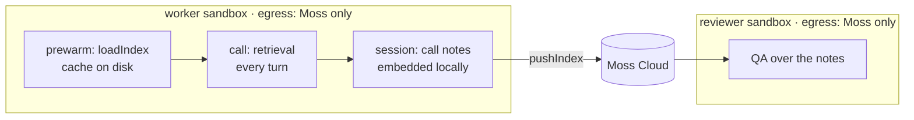
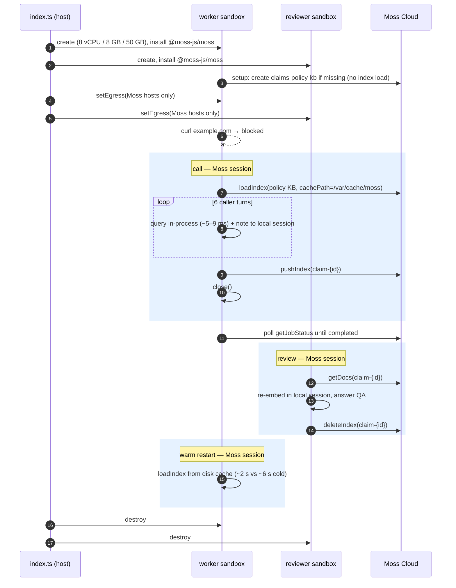

# 58 — Moss voice-agent worker

An insurance claims voice agent whose retrieval runs **in-process** with
[Moss](https://moss.dev). The agent runs inside an egress-locked sandbox, and
after the call it hands its notes to a second sandbox.

Moss loads a search index into the agent's own memory, so every conversational
turn retrieves in a few milliseconds with no network hop. The retrieval layer
therefore lives wherever the agent process lives. This example shows three
things a production voice deployment needs from that home, using the same
workload as Moss's own `insurance-adjuster` example:

1. **Prewarm.** The worker loads the policy knowledge base once, the way a
   LiveKit/Pipecat worker's `prewarm` does. The Moss cache sits on the sandbox
   disk, so a process restart reloads from disk and keeps the same Moss device
   id. Moss bills monthly active devices.
2. **Lock down.** `setEgress` restricts traffic to the Moss hosts only. Caller
   details can't leave the VM for anywhere else, and call notes are embedded
   locally rather than sent to a third-party embedding API. Healthcare and
   finance voice agents are required to work this way.
3. **Hand off.** On `submit_report` the worker pushes the call notes to Moss
   Cloud. A reviewer sandbox, also locked down, loads them for QA and then
   deletes them.



## How a run unfolds

Shaded blocks are the only windows where a process holds a Moss index, which
is what Moss bills as session time.



## Cost-aware by design

Moss bills **session-minutes** for every process that holds a loaded index. All
the sandbox work (boot, install, egress lock) happens before any Moss client
exists. Each Moss step (`call`, `review`, `warm`) is then a short process that
loads, works, closes and exits. A full run costs about **20–25 s** of Moss session
time. The policy KB (`claims-policy-kb`, 15 docs) is created on the first run
and reused afterwards.

## Setup

```sh
cp 58-moss-voice-agent-worker/.env.example .env   # CreateOS + Moss credentials
bun 58-moss-voice-agent-worker/index.ts
```

Get the Moss project id and key from [portal.usemoss.dev](https://portal.usemoss.dev).

## Output (abridged)

```
[3/7] locking egress on both sandboxes to Moss only: service.usemoss.dev, models.moss.link, indexes.moss.link, *.r2.cloudflarestorage.com
      moss:    reachable
      example.com: blocked (caller data can't leave)
[4/7] claim call cmuo44x1t: prewarm, 6 caller turns with in-process retrieval, submit_report…
      prewarm: policy KB loaded in 5965 ms (model + index, cold)
      turn 1    7.8 ms  caller: "Hi, someone rear-ended me at a stop light this morning."
      …
      turn 4    6.3 ms  caller: "I need a car for work, will you cover a rental?"
                       policy: Rental car reimbursement covers up to $40 per day for a maximum of 30 days…
      submit_report: pushed 6 notes as index "claim-cmuo44x1t", ready in 4743 ms
[5/7] reviewer sandbox loads the pushed call notes for QA…
      QA: "which parts of the car were damaged" → "The bumper is crushed and the trunk won't close, it looks expensive."
      QA: "was anyone injured" → "Nobody was hurt, but do I need a police report?"
[6/7] restarting the worker process: reload from the disk cache…
      restart: KB reloaded from /var/cache/moss in 2114 ms, first query 6 ms
[7/7] summary
      retrieval per turn: median 7.74 ms, max 8.62 ms (voice turn budget ~800 ms)
      worker start: cold 5965 ms → restart from disk cache 2114 ms
      Moss session time: 20.4 s across 3 short processes
```

## Notes

- **Egress hosts.** Moss needs `service.usemoss.dev` (API), `models.moss.link`
  (embedding model), `indexes.moss.link` (index downloads) and
  `*.r2.cloudflarestorage.com` (session push uploads). No other host is
  reachable once the lock is on.
- **Session push workaround.** In `@moss-js/moss` 1.14.0 and 1.15.0 an index created by
  `SessionIndex.pushIndex()` is stored with model `custom`, so text queries
  against it fail ("requires explicit embeddings"). The reviewer therefore
  fetches the notes with `getDocs` and re-embeds them in its own local session.
- **Push is async.** `pushIndex()` returns while the index is still
  `building`. The worker unloads its index first, then polls `getJobStatus`
  until the notes are readable, so it holds no Moss session while it waits.
- **Files.** `index.ts` is the host orchestrator. `claims-agent.ts` runs inside
  both sandboxes, with modes `setup`, `call`, `warm` and `review`.
